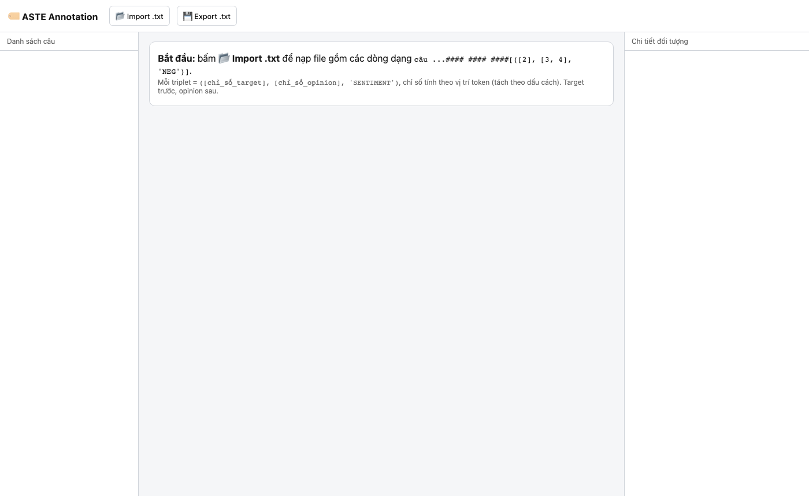
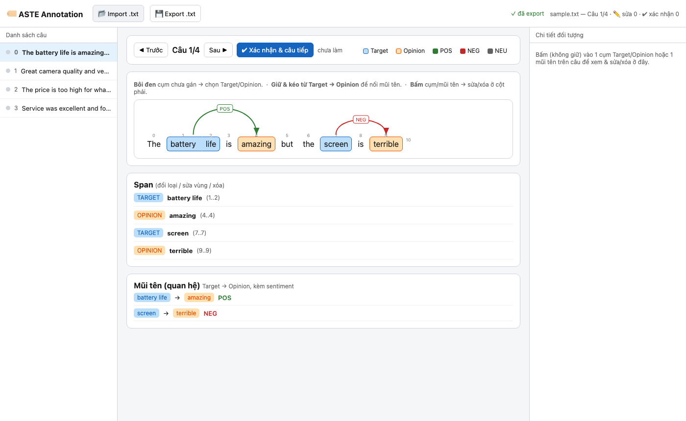
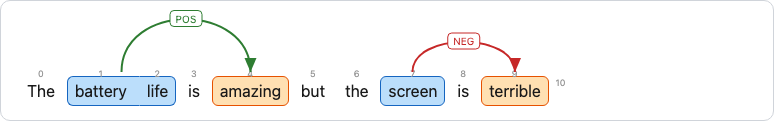
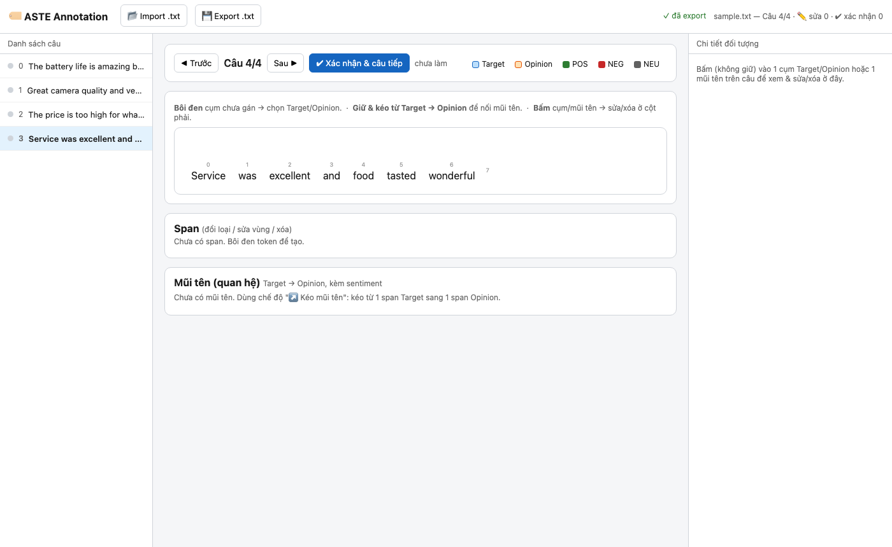
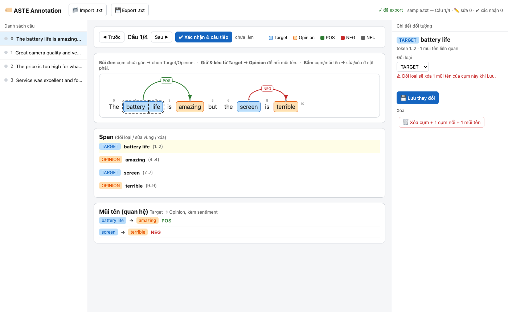

# Hướng dẫn sử dụng — ASTE Annotation Tool

Tool gán nhãn **Aspect Sentiment Triplet Extraction (ASTE)**: mỗi câu được đánh dấu một hoặc nhiều bộ ba *(target span, opinion span, sentiment)*.

---

## Mở tool

Không cần cài đặt. Mở thẳng file trong trình duyệt:

```
aste.html
```

Chạy hoàn toàn offline, hỗ trợ Chrome và Firefox.

---

## Giao diện tổng quan



Khi mới mở, tool hiển thị hướng dẫn nhanh ở giữa. Ba vùng chính:

| Vùng | Chức năng |
|---|---|
| **Sidebar trái** | Danh sách câu, chỉ số tiến độ (chấm màu) |
| **Khu vực giữa** | Canvas token + arc, bảng Span, bảng Mũi tên |
| **Cột phải** | Inspector — sửa/xóa span/mũi tên đang chọn |

---

## Định dạng file

Mỗi dòng trong file `.txt` đầu vào có cấu trúc:

```
token1 token2 ... #### #### #### [([idx_target], [idx_opinion], 'SENTIMENT')]
```

- Tokens phân tách bằng **dấu cách**.
- Chuỗi phân tách cố định: `#### #### ####`
- Chỉ số token bắt đầu từ **0**.
- Nhiều triplet trong một câu: cách nhau bằng dấu phẩy bên trong `[...]`.
- Sentiment hợp lệ: `POS`, `NEG`, `NEU`.

**Ví dụ:**
```
The battery life is amazing but the screen is terrible #### #### #### [([1, 2], [4], 'POS'), ([7], [9], 'NEG')]
```

File **chưa có annotation** (câu trắng):
```
Service was excellent and food tasted wonderful #### #### #### []
```

---

## Bước 1 — Import file

Nhấn **📂 Import .txt** trên thanh công cụ, chọn file `.txt`.

Tool tự động nhảy đến câu **đầu tiên chưa được xác nhận** (chưa có trạng thái `confirmed`), tiện khi mở lại file đang làm dở giữa chừng.

---

## Bước 2 — Đọc hiểu canvas



Sau khi import, câu đầu tiên hiển thị ngay:

- **Token màu xanh dương** = Target span
- **Token màu cam** = Opinion span
- **Cung xanh lá / đỏ** phía trên = mũi tên quan hệ, nhãn `POS`/`NEG`/`NEU` ở giữa cung
- **Số nhỏ phía trên mỗi token** = chỉ số vị trí (dùng để đối chiếu với file)



---

## Bước 3 — Tạo span mới (bôi đen)

Trên câu **chưa có annotation**:



1. **Nhấn token đầu** của cụm cần gán → giữ và kéo đến **token cuối** (hoặc nhấn lần lượt).
2. Một popup xuất hiện hỏi loại span:
   - **Target** — đối tượng được nhắc đến (sản phẩm, dịch vụ…)
   - **Opinion** — từ/cụm thể hiện cảm xúc
3. Chọn loại → span được tô màu tương ứng.

> **Lưu ý:** Một token có thể thuộc cả Target lẫn Opinion cùng lúc — tool hiển thị gradient hai màu.

---

## Bước 4 — Tạo mũi tên (quan hệ)

Khi đã có ít nhất một span Target và một span Opinion:

1. **Giữ chuột và kéo** từ một token trong span **Target** → thả vào một token trong span **Opinion**.
2. Đường cong màu xanh chấm gạch xuất hiện trong lúc kéo để preview.
3. Thả chuột → popup chọn sentiment: **POS**, **NEG**, **NEU**.
4. Mũi tên được vẽ thành cung phía trên hàng token.

> Chỉ kéo được từ **Target → Opinion**, không kéo ngược lại.

---

## Bước 5 — Sửa / xóa span hoặc mũi tên



**Nhấn (không giữ)** vào bất kỳ span hoặc cung mũi tên để mở **Inspector** ở cột phải:

- **Span**: đổi loại (TARGET ↔ OPINION) → nhấn **💾 Lưu thay đổi**. Xóa span sẽ xóa cả span đối tác và mũi tên liên quan.
- **Mũi tên**: đổi sentiment → nhấn **💾 Lưu thay đổi**. Hoặc nhấn **🗑 Xóa mũi tên**.

Danh sách Span và Mũi tên ở bảng bên dưới canvas cũng có thể nhấn để chọn.

---

## Bước 6 — Xác nhận câu

Khi đã hài lòng với annotation của câu hiện tại:

- Nhấn **✔ Xác nhận & câu tiếp** (hoặc phím `Enter`) → câu được đánh dấu `confirmed` (chấm xanh lá trong sidebar) và tool tự chuyển sang câu kế tiếp.

---

## Điều hướng

| Thao tác | Phím tắt |
|---|---|
| Câu trước | `←` |
| Câu sau | `→` |
| Xác nhận & chuyển tiếp | `Enter` |
| Nhảy đến câu bất kỳ | Nhấn vào sidebar |

---

## Bước 7 — Export

Nhấn **💾 Export .txt** để tải file kết quả.

- File xuất ra có tên `<tên_file_gốc>_labeled.txt`.
- Mỗi dòng thêm **cột trạng thái** phân tách bằng tab (`edited` / `confirmed`), giúp lần sau mở lại có thể tiếp tục từ chỗ dang dở.
- Sau khi export, thanh trạng thái chuyển thành **✓ đã export**.

> **Nhắc nhở tự động:** Sau mỗi 20 câu xác nhận mà chưa export, tool hiện banner cảnh báo để tránh mất dữ liệu.

---

## Tự động lưu nháp

Tool liên tục lưu trạng thái vào `localStorage` của trình duyệt. Nếu đóng tab hoặc trình duyệt đột ngột, lần sau mở lại sẽ có tùy chọn **Khôi phục** phiên làm việc trước.

Export xong → nháp bị xóa, phiên tiếp theo bắt đầu sạch.

---

## Chỉ số màu trong sidebar

| Chấm | Ý nghĩa |
|---|---|
| ⚫ xám | Chưa làm |
| 🟡 vàng | Đã sửa, chưa xác nhận |
| 🟢 xanh | Đã xác nhận |
