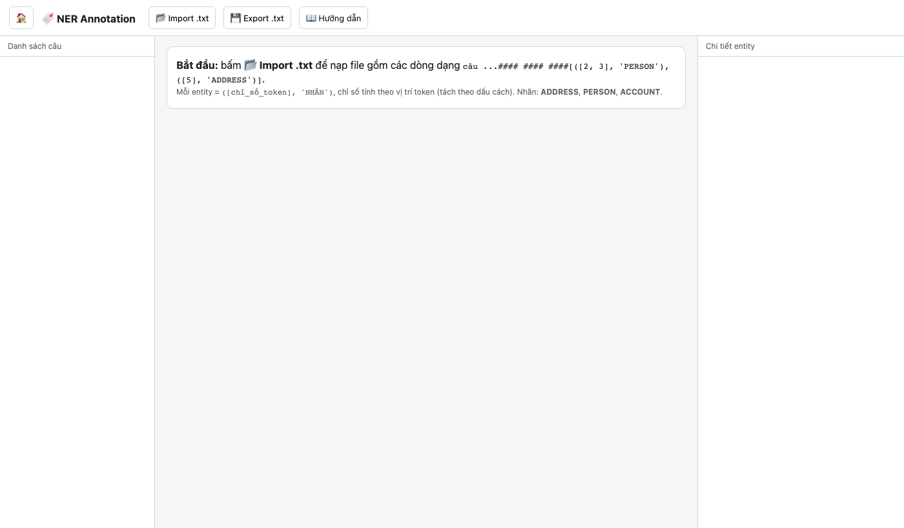
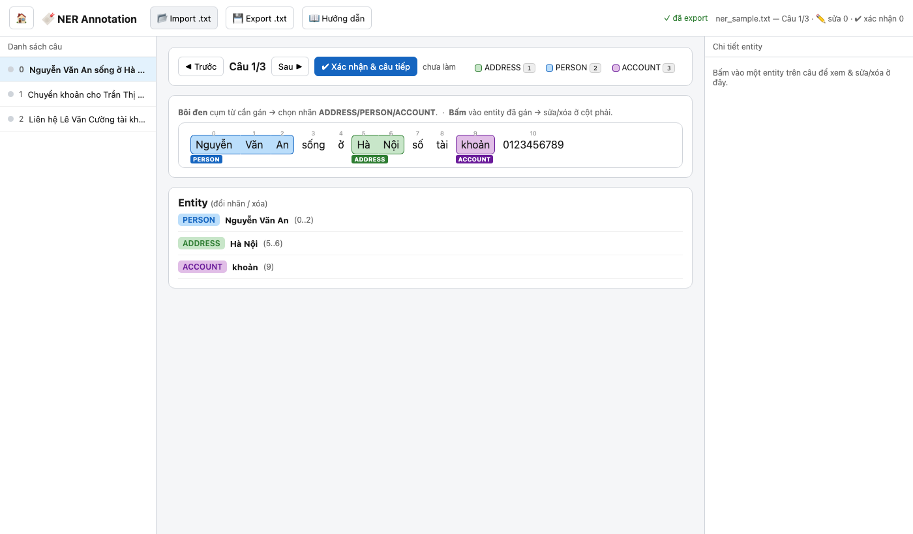
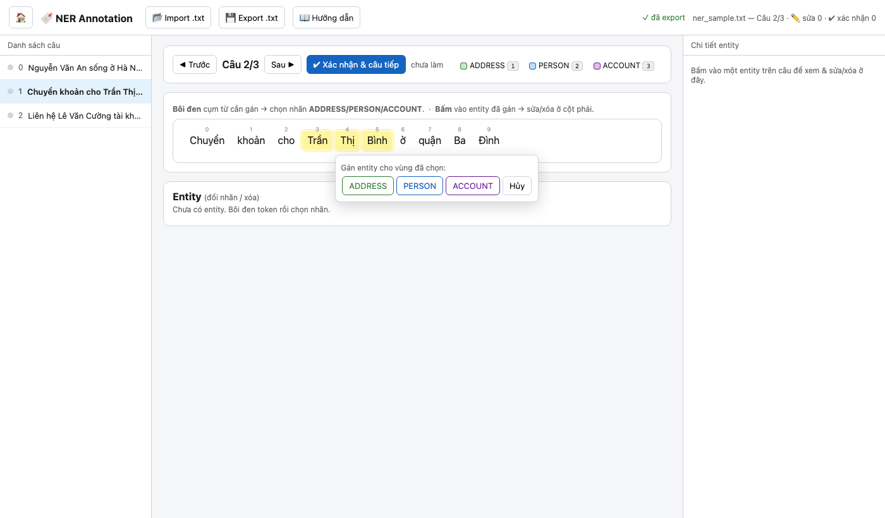
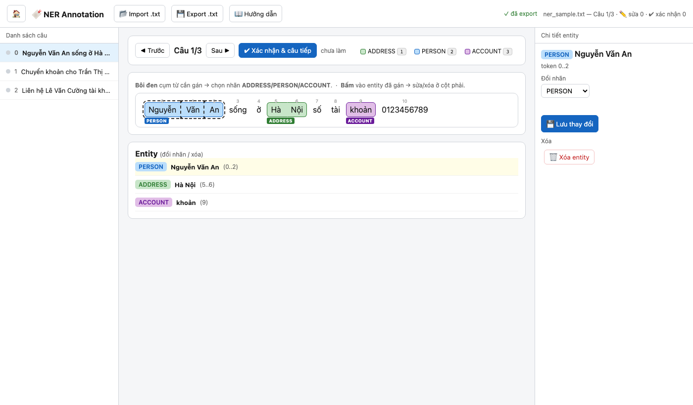

# Hướng dẫn sử dụng — NER Annotation Tool

Tool gán nhãn **Named Entity Recognition (NER)**: đánh dấu các cụm từ trong câu là thực thể và gán một trong ba nhãn cố định — **ADDRESS**, **PERSON**, **ACCOUNT**.

---

## Mở tool

Không cần cài đặt. Mở thẳng file trong trình duyệt:

```
ner.html
```

Chạy hoàn toàn offline, hỗ trợ Chrome và Firefox.

---

## Giao diện tổng quan



Khi mới mở, tool hiển thị hướng dẫn nhanh ở giữa. Ba vùng chính:

| Vùng | Chức năng |
|---|---|
| **Sidebar trái** | Danh sách câu, chỉ số tiến độ (chấm màu) |
| **Khu vực giữa** | Canvas token, bảng Entity |
| **Cột phải** | Inspector — sửa/xóa entity đang chọn |

---

## Định dạng file

Mỗi dòng trong file `.txt` đầu vào có cấu trúc:

```
token1 token2 ...#### #### ####[([chỉ_số_token], 'NHÃN')]
```

- Tokens phân tách bằng **dấu cách**.
- Chuỗi phân tách cố định: `#### #### ####`
- Chỉ số token bắt đầu từ **0**.
- Nhiều entity trong một câu: cách nhau bằng dấu phẩy bên trong `[...]`.
- Nhãn hợp lệ: `ADDRESS`, `PERSON`, `ACCOUNT`.

**Ví dụ:**
```
Nguyễn Văn An sống ở Hà Nội số tài khoản 0123456789#### #### ####[([0, 1, 2], 'PERSON'), ([5, 6], 'ADDRESS'), ([9], 'ACCOUNT')]
```

File **chưa có annotation** (câu trắng):
```
Chuyển khoản cho Trần Thị Bình ở quận Ba Đình#### #### ####[]
```

---

## Bước 1 — Import file

Nhấn **📂 Import .txt** trên thanh công cụ, chọn file `.txt`.

Tool tự động nhảy đến câu **đầu tiên chưa được xác nhận** (chưa có trạng thái `confirmed`), tiện khi mở lại file đang làm dở giữa chừng.

---

## Bước 2 — Đọc hiểu canvas



Sau khi import, câu đầu tiên hiển thị ngay:

- **Token màu xanh dương** = PERSON
- **Token màu xanh lá** = ADDRESS
- **Token màu tím** = ACCOUNT
- **Nhãn nhỏ phía dưới** mỗi entity = loại thực thể
- **Số nhỏ phía trên mỗi token** = chỉ số vị trí (dùng để đối chiếu với file)

Các token cùng một entity được **nối liền** thành một khối màu.

---

## Bước 3 — Tạo entity (bôi đen)

Trên câu **chưa có annotation**:



1. **Nhấn token đầu** của cụm cần gán → giữ và kéo đến **token cuối** (hoặc bôi đen bằng chuột).
2. Một popup xuất hiện hỏi nhãn:
   - **ADDRESS** — địa chỉ, địa danh
   - **PERSON** — tên người
   - **ACCOUNT** — số tài khoản / định danh tài khoản
3. Chọn nhãn → entity được tô màu tương ứng.

> **Phím tắt:** khi đang bôi đen một vùng, nhấn `1` = ADDRESS, `2` = PERSON, `3` = ACCOUNT để gán nhanh; nhấn `Esc` để bỏ chọn.

> **Lưu ý:** các entity **không được đè lên nhau**. Nếu vùng chọn chồng lên một entity đã có, tool sẽ báo lỗi — hãy xóa entity cũ trước rồi gán lại.

---

## Bước 4 — Sửa / xóa entity



**Nhấn** vào bất kỳ entity nào để mở **Inspector** ở cột phải:

- **Đổi nhãn**: chọn nhãn mới trong danh sách → nhấn **💾 Lưu thay đổi**.
- **Xóa**: nhấn **🗑 Xóa entity**.

Danh sách Entity ở bảng bên dưới canvas cũng có thể nhấn để chọn.

---

## Bước 5 — Xác nhận câu

Khi đã hài lòng với annotation của câu hiện tại:

- Nhấn **✔ Xác nhận & câu tiếp** (hoặc phím `Enter`) → câu được đánh dấu `confirmed` (chấm xanh lá trong sidebar) và tool tự chuyển sang câu kế tiếp.

---

## Điều hướng

| Thao tác | Phím tắt |
|---|---|
| Câu trước | `←` |
| Câu sau | `→` |
| Xác nhận & chuyển tiếp | `Enter` |
| Gán nhãn nhanh khi đang bôi đen | `1` / `2` / `3` |
| Bỏ vùng đang chọn | `Esc` |
| Nhảy đến câu bất kỳ | Nhấn vào sidebar |

---

## Bước 6 — Export

Nhấn **💾 Export .txt** để tải file kết quả.

- File xuất ra có tên `<tên_file_gốc>_labeled.txt`.
- Mỗi dòng thêm **cột trạng thái** phân tách bằng tab (`edited` / `confirmed`), giúp lần sau mở lại có thể tiếp tục từ chỗ dang dở.
- Sau khi export, thanh trạng thái chuyển thành **✓ đã export**.

> **Nhắc nhở tự động:** Sau mỗi 20 câu xác nhận mà chưa export, tool hiện banner cảnh báo để tránh mất dữ liệu.

---

## Tự động lưu nháp

Tool liên tục lưu trạng thái vào `localStorage` của trình duyệt (khóa riêng `ner_label_state_v1`, tách biệt với các tool khác). Nếu đóng tab hoặc trình duyệt đột ngột, lần sau mở lại sẽ có tùy chọn **Khôi phục** phiên làm việc trước.

Export xong → nháp bị xóa, phiên tiếp theo bắt đầu sạch.

---

## Chỉ số màu trong sidebar

| Chấm | Ý nghĩa |
|---|---|
| ⚫ xám | Chưa làm |
| 🟡 vàng | Đã sửa, chưa xác nhận |
| 🟢 xanh | Đã xác nhận |
