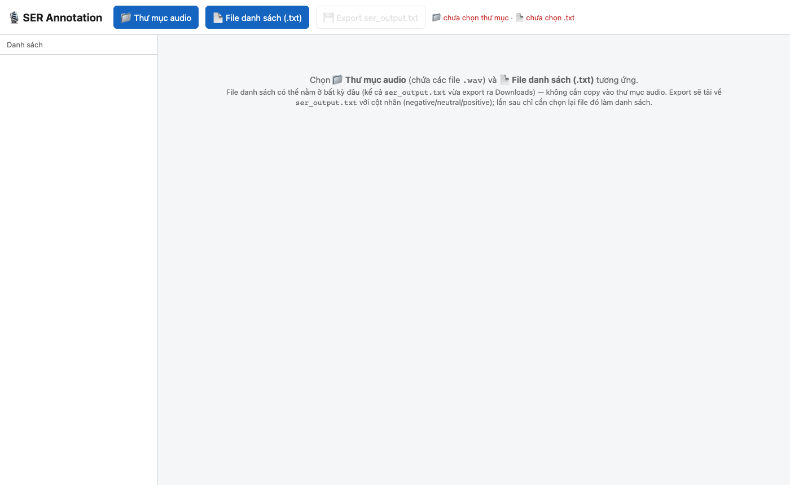
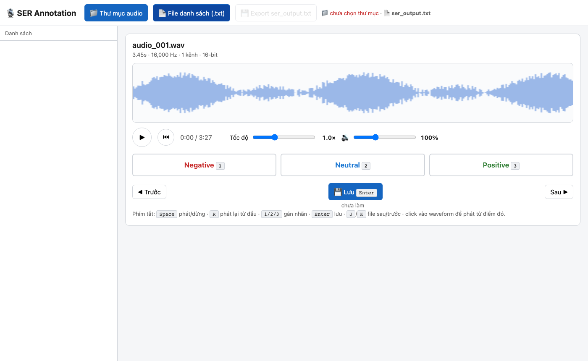
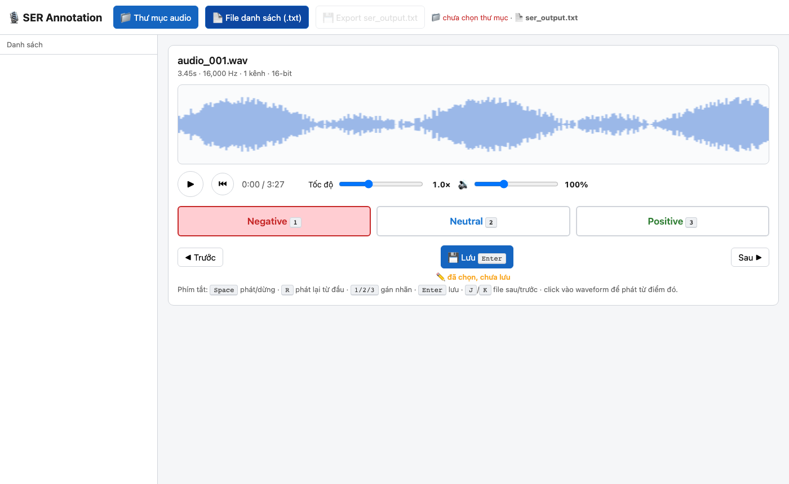

# Hướng dẫn sử dụng — SER Annotation Tool

Tool gán nhãn **Speech Emotion Recognition (SER)**: nghe file `.wav` và gán một trong ba nhãn cảm xúc — **Negative**, **Neutral**, **Positive**.

---

## Mở tool

Không cần cài đặt. Mở thẳng file trong trình duyệt:

```
ser.html
```

Chạy hoàn toàn offline, hỗ trợ Chrome và Firefox.

---

## Giao diện tổng quan



Khi mới mở, tool yêu cầu chọn **hai thứ** tách biệt nhau:

1. **📁 Thư mục audio** — thư mục chứa các file `.wav`
2. **📄 File danh sách (.txt)** — file liệt kê tên các file cần gán nhãn

---

## Định dạng file danh sách

File `.txt` mỗi dòng là một file audio, nhãn tùy chọn ngăn cách bằng **tab**:

```
audio_001.wav
audio_002.wav	negative
audio_003.wav	neutral
audio_004.wav	positive
```

- Dòng **không có nhãn** → chưa làm.
- Dòng **có nhãn** → coi như đã xác nhận, tool bỏ qua khi chọn câu tiếp theo.
- File `ser_output.txt` vừa export ra có thể dùng thẳng làm file danh sách cho lần làm tiếp theo — **không cần copy vào thư mục audio**.

---

## Bước 1 — Chọn thư mục audio

Nhấn **📁 Thư mục audio**, chọn thư mục chứa các file `.wav`.

Tool quét toàn bộ file trong thư mục và lập bảng tra cứu theo tên file. Nếu thư mục có nhiều thư mục con, tool vẫn tìm được theo đường dẫn tương đối hoặc tên file.

---

## Bước 2 — Chọn file danh sách

Nhấn **📄 File danh sách (.txt)**, chọn file `.txt`.

Nếu có file nào trong danh sách **không tìm thấy** trong thư mục audio, tool hiện dialog cảnh báo:

- **Tiếp tục (bỏ qua file thiếu)** — load bình thường, các file thiếu bị bỏ qua khi gán nhãn nhưng vẫn được giữ lại khi export.
- **Không load** — hủy, kiểm tra lại thư mục hoặc file danh sách rồi chọn lại.

Nếu trình duyệt có **bản nháp** từ phiên trước (chưa export), tool hỏi có muốn khôi phục không.

---

## Bước 3 — Gán nhãn



Sau khi load xong, tool tự mở file **đầu tiên chưa làm**. Giao diện gồm:

| Phần tử | Chức năng |
|---|---|
| **Tên file + thông số** | Tên, thời lượng, sample rate, kênh, bit |
| **Waveform** | Biểu đồ sóng âm. Nhấn để seek đến vị trí đó rồi tự phát |
| **▶ / ⏮** | Phát/dừng — Phát lại từ đầu |
| **Tốc độ** | 0.5× – 2×, điều chỉnh bằng thanh trượt |
| **🔊** | Âm lượng 0–300% (dùng Web Audio API GainNode) |
| **Negative / Neutral / Positive** | Nhấn để chọn nhãn |
| **💾 Lưu** | Xác nhận nhãn và chuyển sang file tiếp theo |

**Quy trình gán một file:**

1. Nghe audio (nhấn `Space` hoặc nhấn ▶).
2. Nhấn **Negative** / **Neutral** / **Positive** (hoặc phím `1` / `2` / `3`).
3. Nhấn **💾 Lưu** (hoặc `Enter`) → tool lưu và chuyển sang file tiếp theo.



Nhãn đang chọn được tô nền màu tương ứng. Trạng thái bên dưới nút Lưu cho biết:

- *chưa làm* — chưa chọn nhãn
- *✏️ đã chọn, chưa lưu* — đã chọn nhãn nhưng chưa nhấn Lưu
- *✔ đã lưu* — đã xác nhận

---

## Phím tắt

| Phím | Chức năng |
|---|---|
| `Space` | Phát / dừng |
| `R` | Phát lại từ đầu |
| `1` | Gán nhãn Negative |
| `2` | Gán nhãn Neutral |
| `3` | Gán nhãn Positive |
| `Enter` | Lưu & chuyển file tiếp |
| `J` | File tiếp theo |
| `K` | File trước |

---

## Bước 4 — Export

Nhấn **💾 Export ser_output.txt** để tải file kết quả về máy.

File xuất ra tên cố định `ser_output.txt`, định dạng:

```
audio_001.wav	negative
audio_002.wav	neutral
audio_003.wav	positive
audio_004.wav
```

Dòng chưa có nhãn được giữ nguyên (chỉ tên file).

Sau khi export:
- Bản nháp trong `localStorage` bị xóa.
- Thanh trạng thái chuyển thành **✓ đã export**.
- Lần làm tiếp theo chỉ cần chọn lại `ser_output.txt` làm file danh sách — tool tự nhận các nhãn đã có và bỏ qua những file đó.

---

## Tự động lưu nháp

Mỗi lần nhấn Lưu, nhãn được ghi ngay vào `localStorage` (khóa theo tên thư mục audio). Nếu đóng tab đột ngột, lần sau mở lại và chọn đúng thư mục + danh sách, tool sẽ hỏi có muốn **Khôi phục bản nháp** không.

Export xong → nháp bị xóa hoàn toàn.

---

## Chỉ số màu trong sidebar

| Chấm | Ý nghĩa |
|---|---|
| ⚫ xám | Chưa làm |
| 🟡 vàng | Đã chọn nhãn, chưa nhấn Lưu |
| 🟢 xanh | Đã lưu (confirmed) |

File thiếu audio hiển thị mờ trong sidebar và không thể gán nhãn.
